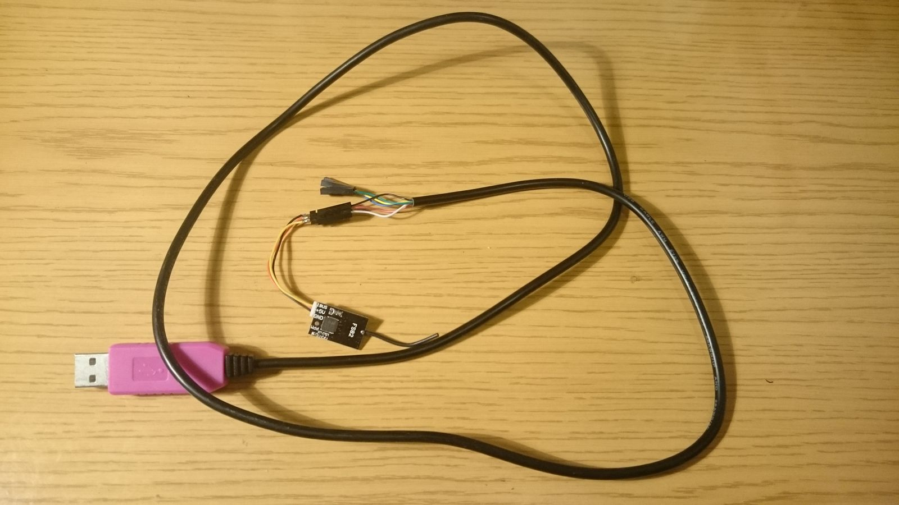

# VJoySerialFeeder using FlySky receiver #

If you have a FlySky controller with a spare receiver it is very easy to use it with vJoySerialFeeder, since the IBUS pin of the receiver is in fact a UART TX pin working at 115200 bps.

> Note: If you use the links below to buy _anything_ from Banggood you will be helping [Drone Mesh](https://www.youtube.com/channel/UC3c9WhUvKv2eoqZNSqAGQXg)'s youtube channel (the price you pay is _not_ affected by this in any way). He is making great video tutorials for this project and deserves our support.

To make it work you need some kind of 5V UART<->COM converter. It is most convenient to use one of those [UART USB cables](https://www.banggood.com/6Pin-FTDI-FT232RL-USB-To-Serial-Adapter-Module-USB-TO-TTL-RS232-Arduino-Cable-p-1035802.html?p=CS101558118042016088&utm_content=huangguocan&utm_campaign=mesh.drone) or [FTDI adapter](https://www.banggood.com/FT232RL-FTDI-USB-To-TTL-Serial-Converter-Adapter-Module-For-Arduino-p-917226.html?p=CS101558118042016088&utm_content=huangguocan&utm_campaign=mesh.drone). Video tutorial [here](https://www.youtube.com/watch?v=sp9Fq9gAqXk).

If you don't have UART adapter but you have some [Arduino](https://www.banggood.com/ATmega328P-Nano-V3-Controller-Board-Compatible-Arduino-p-940937.html?p=CS101558118042016088&utm_content=huangguocan&utm_campaign=mesh.drone&cur_warehouse=CN) board with USB port - you can use it. Basically you would use it just for its UART converter and you don't need the microcontroller at all (but you **MUST** make sure that the Arduino pin labeled TX is **NOT SET AS OUTPUT**, or you can burn a pin on the Arduino or in the receiver). Video tutorial [here](https://www.youtube.com/watch?v=TRnu2_TI9Vk).

Here is an example how to connect the receiver to the PC by using a UART USB cable (it would be practically the same for a FTDI adapter):

In the picture above, [FS82](https://www.banggood.com/FS82-MICRO-2_4G-8CH-Flysky-Compatible-Receiver-With-PPM-I-Bus-Output-p-1137378.html?p=CS101558118042016088&utm_content=huangguocan&utm_campaign=mesh.drone) micro receiver has been used which is cheap and perfect for this use (other options: [link](https://www.banggood.com/818CH-Mini-Receiver-With-PPM-iBus-SBUS-Output-for-Flysky-i6-i6x-AFHDS-2A-Transmitter-p-1183313.html?p=CS101558118042016088&utm_content=huangguocan&utm_campaign=mesh.drone), [link](https://www.banggood.com/Flysky-FS-A8S-2_4G-8CH-Mini-Receiver-with-PPM-i-BUS-SBUS-Output-p-1092861.html?p=CS101558118042016088&utm_content=huangguocan&utm_campaign=mesh.drone)). A three pin header strip is soldered at the end of its wires for easy connection to the USB cable. The connections should be as follows:

UART USB Cable/FTDI adapter | FlySky Receiver
-----          | ----
GND            | GND
+5V            | +5V
RX             | IBUS

Please note that in some rarer FTDI adapters RX and TX labels are reversed. Always make sure you connect the IBUS pin to the pin of the FTDI where it expects the signal to go IN (towards the PC) - almost always that is RX

After connecting the receiver to the PC through the cable/adapter, you should bind it to your radio controller, if not already bound. It is convenient to define a dedicated model in your controller for this receiver.

Then you should select the correct COM port, select `IBUS` protocol and hit `connect`.

Map your channels and enjoy your wireless controller with your favorite sims.

## IA6 receiver support

IA6 receiver is also supported. It does not provide ready to use IBUS pin but still the signal can be found as explained [here](http://endoflifecycle.blogspot.com/2016/10/flysky-ia6-ibus-setup.html). The protocol is slightly different so once you select the `IBUS` protocol you'll have to click on the `Setup` button next to it and check `IA6 Compatible IBUS protocol`.

