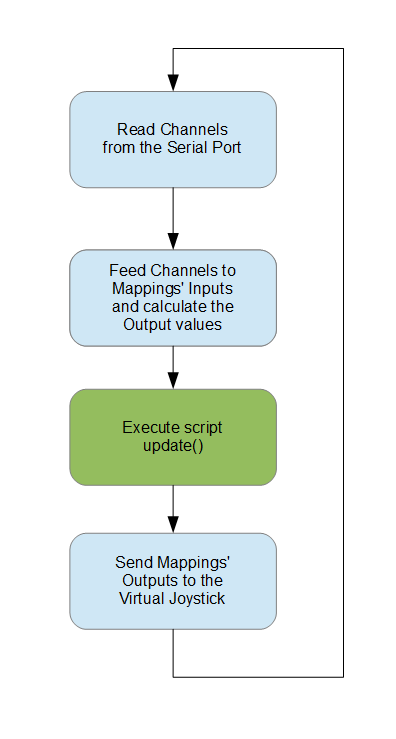

# Scripting

If the provided Mappings are not sufficient for your needs, you can create
custom actions by using a script.

Scripts are written in the [Lua](http://www.lua.org) language. The script is executed _once_ on Serial Connect or if
you edit the script while you are connected.
Your script can do any initialization it needs but the most important thing is to define the
specially named function `update()`. This function will be called on every update.

The Lua environment comes with the following modules preloaded:
* basic functions
* `string`
* `table`
* `coroutine`
* `bit32`
* `os` (time functions only)

With scripts you can:
* Modify Mapping's `Input` and `Output`
* Read the raw serial channels
* Write directly to the Virtual Joystick

## Creating a script
vJoySerialFeeder has built in Lua editor. You can open it from the `Script`>`Add` menu or with the `Add Script`
button on the main interface.

## Script text output
When developing and debugging a script it is helpful to be able to use the Lua `print` function.
The output of it can be seen through the `Script`>`Output` menu.

## API

### Globals
To interact with vJoySerialFeeder the following global functions and objects are defined:

#### function: Mapping(index)
* `index` index of the mapping (starting from 1)
* returns \<[Mapping](#object-mapping)>

Gets the [Mapping](#object-mapping) object for the requested `index`

#### object: VJoy \<[VJoy](#object-vjoy)>

Interface for the Virtual Joystick

#### function: Channel(index)
* `index` channel index (starting from 1)

Gets the raw serial integer value for channel `index`

#### variable: Failsafe \<boolean>
Tells if Failsafe mode is active. Writing to this variable has no effect.

---

### object: Mapping

#### property: Input \<integer>

On read, returns the `Input` value of the mapping.\
The property is writable, but make sure you set the mapping's channel to zero,
otherwise your changes will soon be overwritten by serial data.
The `Output` of the Mapping is automatically updated on write.

#### property: Output \<float>

On read, returns the `Output` value of the mapping. The value depends on
mapping type (see [More about Mappings](Mappings.md)).\
The property is writable, but make sure you set the mapping's channel to zero,
otherwise your changes will soon be overwritten by serial data.
The `Input` of the Mapping is unaffected on write.

#### property: Type \<string>

The Mapping's type as string. Read-only.

---

### object: VJoy

#### method: SetAxis(axis, value)
* `axis` \<integer> axis number (starting from 1)
* `value` \<float> axis value (0.0 to 1.0)


#### method: SetButton(button, pressed)
* `button` \<integer> button number (starting from 1)
* `pressed` \<boolean> button pressed state (true or false)


---

For convenience the following global variables are defined to be used with the `SetAxis()` function:

Name | Value
--- | ---
`AXIS_X` | 1
`AXIS_Y` | 2
`AXIS_Z` | 3
`AXIS_RX` | 4
`AXIS_RY` | 5
`AXIS_RZ` | 6
`AXIS_SL0` | 7
`AXIS_SL1` | 8

## Order of execution

Here's a overall diagram of the vJoySerialFeeder's main loop.




There two important things to note:
1. Your script is executed _after_ the Mappings are updated with the new
serial channel data. Thus your script _can overwrite_ the `Input` and `Output`
of the Mappings.

2. Your script is executed _before_ the Mappings' `Output`s are sent to
the virtual joystick. Thus any changes to the joystick that you made in your
script through the [VJoy](#object-vjoy) object
_will be overwritten_ by Mappings that use the same axes/buttons.

## Examples

### Mode switch
Imagine you have hardware stick with two axes but you want to be able to command
different virtual joystick axes based on a switch position. With scripting you can do this. Define the following Mappings:

Index | Mapping Type | Channel | Virtual Axis/Button
--- | ---- | --- | ---
1 | Axis |1 | X
2 | Axis |2 | Y
3 | Axis |1 | Rx
4 | Axis |2 | Ry
5 | Button | 3 | not needed, you can set to 0

Let's say your stick's X and Y come through channels 1 and 2. Channel 3 is the switch.\
If you run the above configuration without any scripting, obviously X/Rx and Y/Ry will move together, since
they read from the same channels. But if we provide this script:

```Lua
function update()
    if Mapping(5).Output > 0 then
        Mapping(1).Output = 0.5
        Mapping(2).Output = 0.5
    else
        Mapping(3).Output = 0.5
        Mapping(4).Output = 0.5
    end
end
```
then based on our switch position only X/Y or Rx/Ry will be active, while the other pair will be centered.

### Function Generator
Here is one probably not very useful example, but it provides a showcase of
the API.\
The script generates a harmonic signal sent to the X axis of the virtual joystick.
Channel 1 controls the frequency, Channel 2 - the amplitude.\
Here we read the Channels directly, but in practice it will be
easier to use an Axis Mapping for that and get the value from its `Output`. The
same holds for writing to the joystick - it is preferred to add a mapping
for the desired axis/button with
channel set to 0 and then write to its `Output` in script.

```Lua
local prev_time = os.time()
local phase     = 0

function update()
    local freq, ampl, now, tdiff, val

    -- assuming channel data is in the [1000; 2000] range
    freq = (Channel(1) - 1000)/1000.0 -- frequency between 0 and 1Hz
    ampl = (Channel(2) - 1000)/1000.0 -- amplitude [0; 1]

    now       = os.time ()
    tdiff     = os.difftime(now, prev_time)
    prev_time = now

    phase = phase + 2*math.pi*freq*tdiff
    phase = phase % (2*math.pi) -- keep the phase between [0; 2pi]

    val = ampl*math.sin(phase)
    val = val/2 + 0.5 -- scale sine from [-1; 1] to [0; 1]

    VJoy.SetAxis(AXIS_X, val)
end
```


