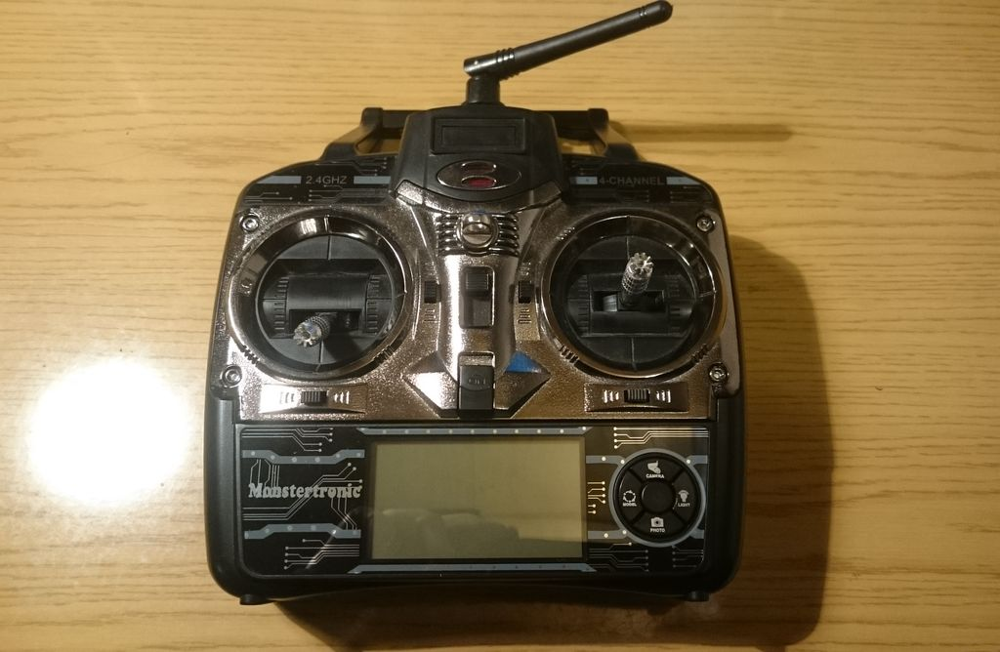
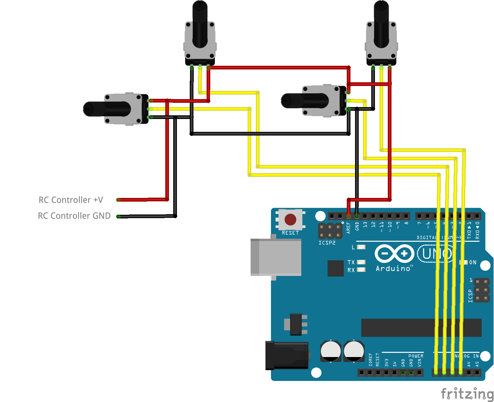
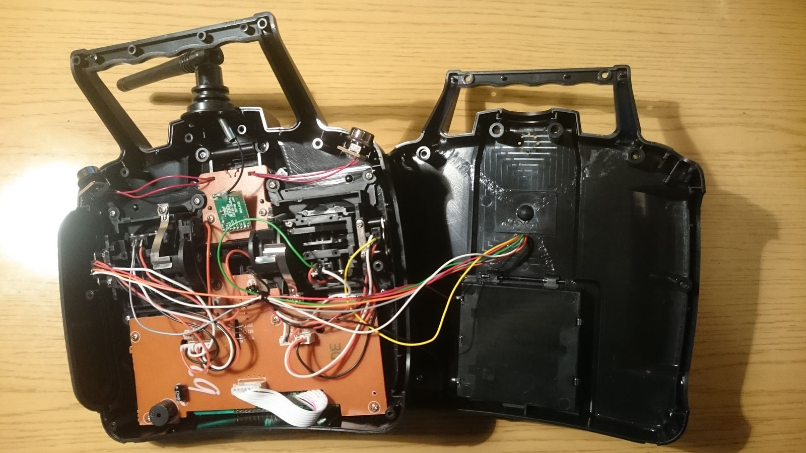
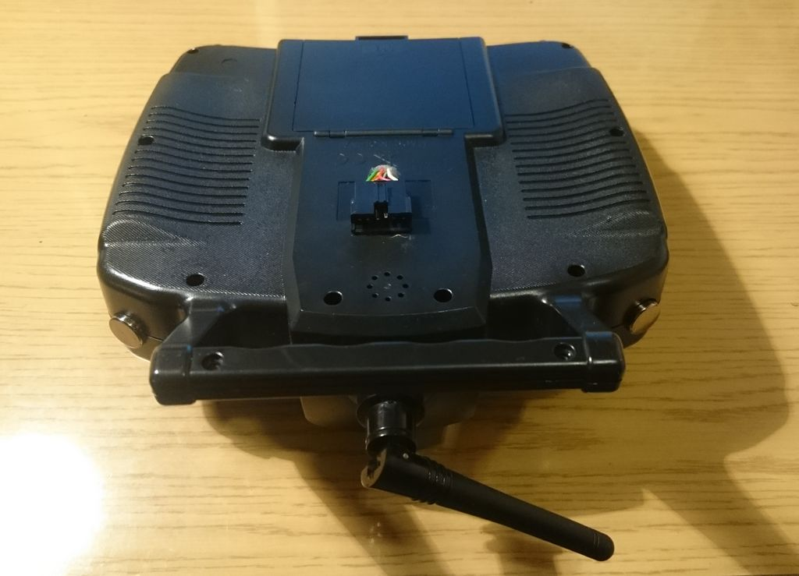
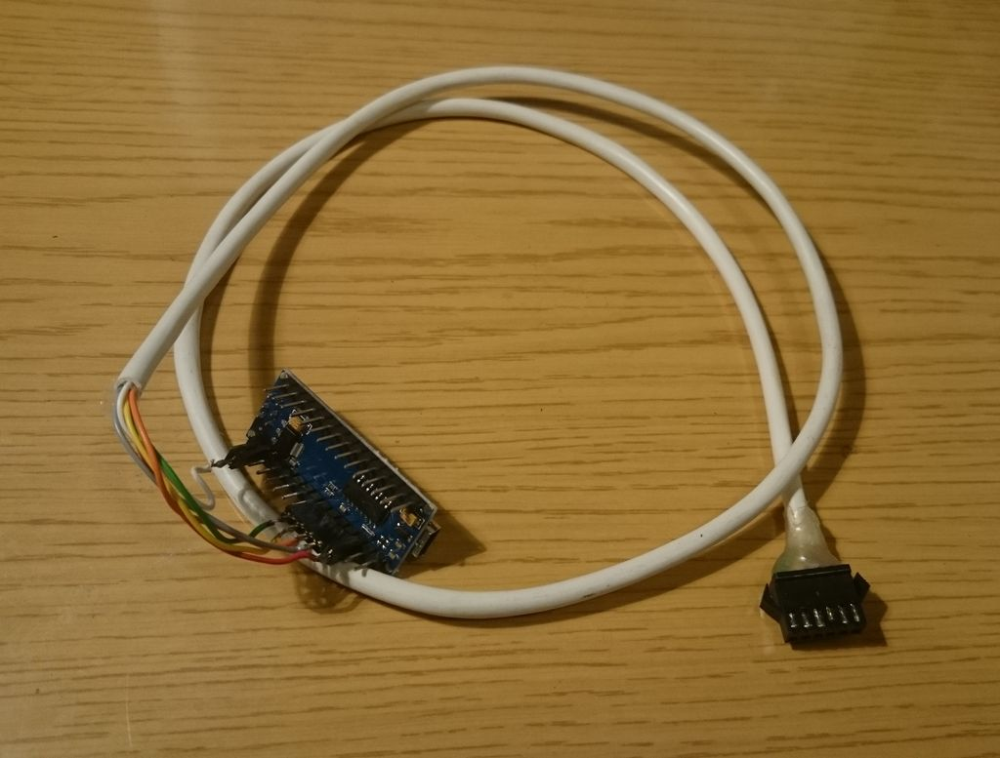

# VJoySerialFeeder using Arduino #

## General usage ##
It is very easy to use VJoySerialFeeder with Arduino. You can use [this simple sketch](../Arduino/Joystick) to make your Arduino board ready to send data over IBUS protocol. Refer to the comments in the beginning of the sketch for instructions on how to configure your board.

Analog data is read using the 10-bit ADC which results in channel values between 0 and 1023.

Digital data is read from the digital pins and is send as channel values 0 for LOW and 1023 for HIGH _or_ up to 16 digital pins can be encoded as bits (0 or 1) in a single channel (channel values are 16-bit integers).

Analog channels are most easily implemented with potentiometers and digital - with switches.

## Using old toy-grade RC controller for PC simulators ##
If you have an old toy RC controller it is quite easy to read its pots with arduino. Here is an example how such a controller has been modified.



In general, every potentiometer in the RC controller has three pins - the two outer pins are for Ground and +Voltage and the center pin is for reading the output (it varies between 0 and +Voltage, depending on the rotation).

The center pins of the four pots must be connected to four of the analog pins of the Arduino.

Then you must identify the Ground pins of the pots and connect them to a GND pin of the Arduino. You need to connect just _one_ of them because they are all connected inside the controller anyway.

Finally, for the +V pins of the pots there are two options:

(a) If the RC controller has its own power supply and you want to use it, you should connect the +V pins (again just one is needed) to the AREF pin of Arduino. In this case you must be sure that you have this definition in your sketch:
```c
#define ANALOG_REFERENCE EXTERNAL
```
In this scenario the RC controller will supply the positive voltage to the pots and Arduino will use it as a reference for the ADC.



(b) If you don't want to use the RC controllers's power supply you can connect a +5V pin of the Arduino to the +V pins of the pots.

**WARNING!**\
In this case the 5V you supply will most certainly propagate to the circuits of the RC controller and the controller may be powered up. If the 5 Volts are insufficient or are too high for the RC controller it might be damaged. If you are not sure what to do, the safest thing is to use (a).

If after all you decide to use Arduino's supply you should:
```c
#define ANALOG_REFERENCE DEFAULT
```
A hole has been drilled in the back of the controller and 6-wire cable has been put through. Four of the wires are soldered to the four middle pot pins. The remaining two are soldered to GND and +V pins of one of the pots:


A 6-pin JST SM connector is glued to the case:


The cable connecting the controller with the Arduino Nano:


In VJoySerialFeeder select the correct COM port, baud rate is 115200 (you can change it in the sketch). Select IBUS protocol and hit **connect**.

Map your channels and enjoy!
