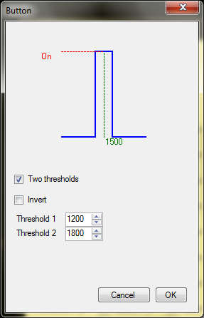

# VJoySerialFeeder Manual #
## Basic concepts ##

* Channel.\
A channel is a stream of integer values coming through the serial port. There can be one or more channels multiplexed over the same serial line.\
_Tech details:_ Serial data arrives in _frames_. Different protocols use different frame structures but in most cases they all can be decoded as an array of integers. The stream consisting of the _first_ values from the arrays of each frame can be thought of as _channel 1_. The second values in the arrays represent _channel 2_ and so on.

* Mapping.\
A mapping is a rule which transforms the integer channel data in a value that can be fed to vJoy. There are two types of mappings:
  1. Axis Mapping - used to transform a channel to a joystick axis (X, Y, Slider, etc.).
  2. Button Mapping - used to transform channel value to a binary button state - pressed/depressed.
  
## How to use ##
1. First you have to decide how you are going to get the serial data you need. Refer to [Use cases](../README.md).

2. After your data provider is ready you should select the COM port and baud rate.

3. Select the correct serial protocol.

4. Select the vJoy joystick instance (if there are more than one).

5. Click the **Connect** button. If everything is OK you should see in the status bar something like:

6. Open the **Channel Monitor** and see if everything seems to be working OK. Try changing your inputs and confirm that channels are changing value.

7. Start mapping!\
Use the **Add Axis** and **Add Button** buttons to add mappings to the interface.\
All mappings can take data from only one channel. What is done with the data depends on the mapping type.
  * In Axis Mappings, there is a **Axis** dropdown menu from which you can select the joystick axis which you would like to command with the selected channel. Please note that your vJoy configuration may or may not have some of the axes enabled.\
Axis Mappings can be thought of as a function which take the input channel value and returns axis value between 0% and 100%.\
  In the **Setup** dialog there are various parameters which can be tweaked to make that function do what you need.
 
 
  
   **Symmetric** tells if the axis has a center point. For example: symmetric axes are the X, Y of a joystick, while an asymmetric axis is the throttle. **Center** and **Deadband** parameters are available only in symmetric mode.\
  **Invert** simply inverts the function output - 0% becomes 100% and vice versa.\
  The **Minimum** parameter determines the channel value which will transform to 0% axis position (100% in inverted). Channel values _less_ than **Minimum** are ignored and axis position will still be 0%.\
  The **Maximum** parameter is analogous.\
  The **Center** parameter determines the channel value which will translate to 50% axis position.\
  The **Deadband** defines a range around the center point which will always translate to 50% axis position.\
  **Expo** makes the channel value transformation a non linear function. The most common use is to make your controls less sensitive around the center and fully responsive near the endpoints.\
  The **Calibrate** button allows easy setting of the **Minimum**, **Maximum** and **Center** parameters. Just click it and follow the instructions.
  
  * Button Mappings work by defining one or two thresholds.
  
  
  
  In **one threshold** mode the button state is determined depending on the value being _lower_ or _higher_ than the threshold.\
  In **two thresholds** mode the button is in one state if the value is _between_ the two thresholds and in the other state if it is _outside_ them.\
  Your mapping can set the state of vJoy buttons numbered from 1 to 128. Please note that the actual number of buttons available depends on the vJoy configuration.\
  The **Invert** parameter inverts the button logic.\
  The **Calibrate** buttons allows for easy setup of the threshold. It only works in **one threshold** mode.
  
  
8. Save your your configuration as a **Profile**. Enter a profile name in the text box and click **Save**. The last used profile is automatically loaded on next run.
